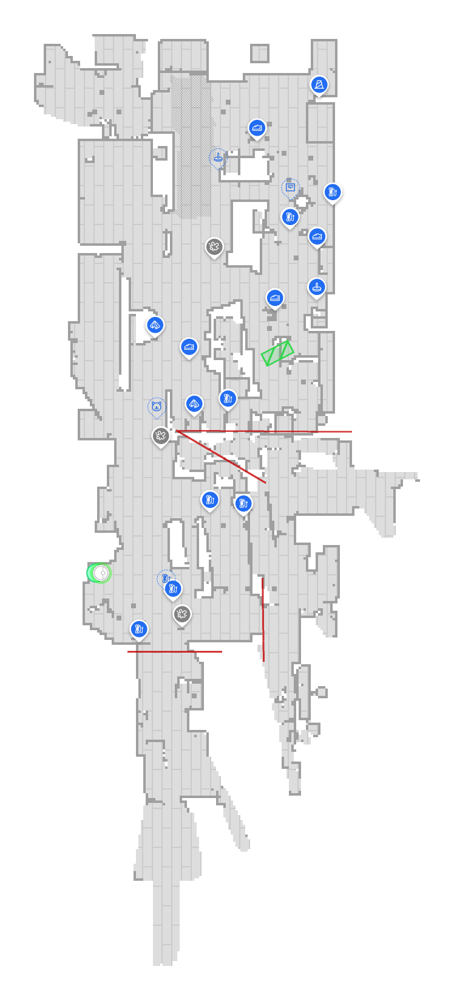
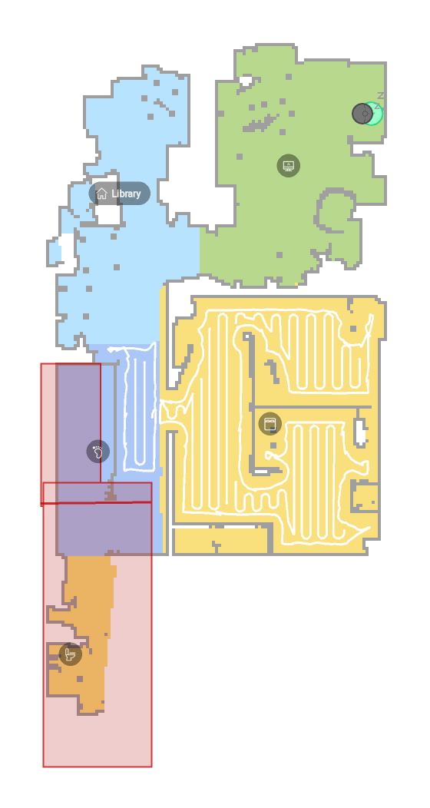

<!-- TermiteTowers Continuous Code Management Header TEMPLATE --- %ccm_git_header_start:  % -->
<!-- %ccm_git_repo: TermiteTowers % -->
<!-- %ccm_git_branch: dev1 % -->
<!-- %ccm_git_object_id: hams/docs/vacuum-maps.md:174 % -->
<!-- %ccm_git_author: mpegg % -->
<!-- %ccm_git_author_email: mpegg@hotmail.com % -->
<!-- %ccm_git_blob_sha: 28aa306f55dc90c4986a575949896b7c027286aa % -->
<!-- %ccm_git_commit_id: da4a17aa441e345b23a66ad8ed67773c5edcd740 % -->
<!-- %ccm_git_commit_count: 174 % -->
<!-- %ccm_git_commit_date: 2026-10-06 19:11:37 -0400 % -->
<!-- %ccm_git_commit_author: mpegg % -->
<!-- %ccm_git_commit_email: mpegg@hotmail.com % -->
<!-- %ccm_git_commit_message: vacuum maps + house layout: stair geometry refined (two-run switchback, 2 ft second-floor offset) % -->
<!-- %ccm_git_modify_date: 2026-10-06 19:11:37 % -->
<!-- %ccm_git_file_last_modified: 2026-10-06 19:11:20 % -->
<!-- %ccm_git_file_name: vacuum-maps.md % -->
<!-- %ccm_git_path: hams/docs/vacuum-maps.md % -->
<!-- %ccm_git_language_mode: markdown % -->
<!-- %ccm_git_file_type: text/plain % -->
<!-- %ccm_git_file_encoding: utf-8 % -->
<!-- %ccm_git_file_eol: CRLF % -->
<!-- %ccm_git_exec: no % -->
<!-- %ccm_git_size: 16529 % -->
<!-- TermiteTowers Continuous Code Management Header TEMPLATE --- %ccm_git_header_end:  % -->
 <!-- %git_commit_history: 2026-10-06 mpegg  vacuum maps doc + house-layout vertical structure  --> 
# Vacuum maps — robots, floors, and how their maps line up with the house model

> **What this is:** the two robot vacuums' current floor plans, saved as PNGs, plus
> a room-by-room reconciliation between what **each robot** labels on its map and
> what **HA** (`house-layout.md`) calls the same space. It exists to answer "which
> floor does each robot clean, and does its map match our model of the house?"
>
> **What this is NOT:** an authority for any live value. Room labels, coordinates,
> and map images are a **point-in-time read** from the robots. Robots get re-mapped,
> rooms get renamed in the Dreame app, and a floor plan drifts with furniture. Always
> re-read live (see §7) before acting.
>
> **Companion files:** [house-layout.md](house-layout.md) (the house model this is
> compared against) · [hal-context.md](hal-context.md) (instance snapshot) ·
> [integrations.md](integrations.md).

- **Created:** 2026-10-06, from a live read of the `dreame_vacuum` map cameras.
- **Sources:** `camera.l40_map` / `camera.dreamebot_l10_pro_map` (snapshot PNGs) and
  their live `rooms` attribute (names + bounding boxes).
- **Status:** the *robot-side* facts (room names, boxes, icons, floor split) are
  **read live and are verified**. The *HA-side* mapping (robot room → `area_id`) is
  **inference** where marked; only the obvious ones are high-confidence.
- **Owner confirmations (2026-10-06):** Recreation Area = `hobby_room` (**Green
  Room**); **Cat box** = a Green Room sub-segment; **Room 5 / Room 11** are unused
  fractions; the L40 has **no access** to the Sauna, 1st Bath, Laundry, Catio or
  Entry (the Green Room's barn doors are its boundary); the Ground ⇄ Second flight
  is a **switchback (U-turn) stair in two runs (~8 ft, U-turn, ~2 ft)** whose rise
  splits **~80 % / ~20 %** — the **Second floor (its main part) holds the ~80 %** and
  the **Ground floor the ~20 %** (see §6).

---

## 1. The two robots, and which floor each maps

| Robot | Vacuum entity | Map camera | Floor it maps | HA floor |
|---|---|---|---|---|
| **DreameBot L40** | `vacuum.l40` | `camera.l40_map` | **Ground floor** (kitchen, living room, sauna, bath…) | `level: 1` |
| **DreameBot L10 Pro** | `vacuum.dreamebot_l10_pro` | `camera.dreamebot_l10_pro_map` | **Second floor** (office, bedroom, library, bath…) | `level: 2` |

Both vacuum entities are filed under the **`utility`** area in HA (a catch-all, not
a real room — [house-layout.md §2.1](house-layout.md)), so the HA area says nothing
about where the robot actually works. The **floor each maps is read from the map
itself**, not from HA.

> Note the colloquial↔registry trap: HA's **Ground floor is `level: 1`**, which is
> the household's **"first floor"**. Both robots' *current* maps are exposed, plus one
> **saved** map each (`camera.l40_map_1`, `camera.dreamebot_l10_pro_map_1`). This doc
> covers the two *current* maps.

---

## 2. Capturing / refreshing a map snapshot

The map cameras are authenticated image endpoints. Pull a snapshot with the HA
long-lived token that the repo's HA-MCP client already holds
(`infra/mcp/home-assistant/config.json` → `.token`):

```bash
cd /home/mpegg-adm/source/TermiteTowers
TOKEN=$(jq -r .token infra/mcp/home-assistant/config.json)

curl -s -H "Authorization: Bearer $TOKEN" \
  -o hams/docs/maps/l40-current-map_$(date +%F).png \
  'http://homeassistant.local:8123/api/camera_proxy/camera.l40_map'

curl -s -H "Authorization: Bearer $TOKEN" \
  -o hams/docs/maps/l10-pro-current-map_$(date +%F).png \
  'http://homeassistant.local:8123/api/camera_proxy/camera.dreamebot_l10_pro_map'
```

- The **`/api/camera_proxy/...`** path above needs the bearer token. The
  `entity_picture` attribute on each camera also carries a short-lived per-entity
  `token=` you can append instead.
- The robots' own **`/local/`** static path is served **without auth** (a missing
  file returns `404`, not `403`), so anything the Dreame app writes there is public
  on the LAN — do not treat the maps as private.
- **Renders differ by activity:** the L40 (idle) snapshot draws the floor plan with
  the room-icon overlay and red **virtual-wall** segments; the L10 Pro snapshot
  (just after a job) draws **room colours + cleaning passes**. Same endpoint, different
  overlay — compare shapes, not colours.

---

## 3. L40 map — Ground floor (`level: 1`)

### 3.1 Saved snapshot



### 3.2 Rooms as the **robot** labels them (live read)

Coordinates are the robot's map units (**millimetres**); `x`,`y` is the label anchor,
`x0..x1 / y0..y1` is the room's bounding box.

| # | L40 room name | Icon | Bounding box (x0,y0 → x1,y1) | Anchor (x,y) |
|---|---|---|---|---|
| 1 | Living Room | sofa | 1150,2450 → 4400,7900 | 3000,5200 |
| 2 | Fitness Area | dumbbell | -700,-2200 → 3050,2250 | 200,200 |
| 3 | Bathroom | toilet | 2900,-2500 → 4500,700 | 3750,-900 |
| 4 | Recreation Area | gamepad | 3000,-4950 → 4250,-2350 | 3650,-3250 |
| 5 | Room 5 | — | 300,-8500 → 2700,-1950 | 1000,-5200 |
| 6 | Stairs | — | -1000,3250 → 250,6300 | -450,4900 |
| 7 | Kitchen | chef-hat | -1700,7550 → 4450,10600 | 1500,9100 |
| 8 | Sauna | — | 2800,300 → 6150,2400 | 4300,1250 |
| 9 | Corridor | footprint | -800,2250 → 2050,8750 | 750,5500 |
| 10 | Cat box | — | 1150,0 → 2900,2550 | 1950,800 |
| 11 | Room 11 | — | 1400,1400 → 2800,2450 | 2250,2100 |

11 segments. **Room 5** and **Room 11** carry no descriptive label — they are the
auto-generated "Room N" placeholders the robot uses when it has not been told a name,
and the owner confirms they are **unused segmentation fractions**, not rooms (§3.3).
**Cat box** is the owner's own label for the **Green Room**'s litter corner (§3.3).

### 3.3 Mapping the L40 rooms onto the house model

| L40 room | → HA `area_id` | HA name | Confidence |
|---|---|---|---|
| Kitchen | `kitchen` | Kitchen | **High** |
| Living Room | `living_room` | Living Room | **High** |
| Corridor | `hallway` | Hallway | **High** (the Ground-floor spine) |
| Fitness Area | `workout` | **Backroom** (exercise room) | **High** (dumbbell icon) |
| Recreation Area | `hobby_room` | **Green Room** | **Confirmed** (owner) |
| Cat box | `hobby_room` | **Green Room** — a sub-segment | **Confirmed** (owner) — cut out for spot-cleaning after the litter box cycles |
| Stairs | *(no area)* | — | n/a — the Ground⇄Second staircase ([§2.2](house-layout.md)) has no HA area; it is a **switchback stair (~8 ft / U-turn / ~2 ft)** split **~80 % Second-floor / ~20 % Ground-floor** (§6) |
| Sauna | `sauna` | Sauna | **Mapped, but no vac access** (owner) — reached only through the 1st Bath |
| Bathroom | `bathroom` | **1st Bath** | **Mapped, but no vac access** (owner) |
| Room 5 | *(unused)* | — | **Not a room** — an unused segmentation fraction (owner) |
| Room 11 | *(unused)* | — | **Not a room** — an unused segmentation fraction (owner) |
| — | `entry` | Entry | **No vac access** — airlock; both interior leaves rest closed |
| — | `laundry` | Laundry | **No vac access** (owner) |
| — | `catio` | Catio | **No vac access** — reached only via the Laundry |

**Where the vac actually goes.** Ignore the two placeholder fractions and the
mapped-but-unreachable rooms and the L40's *reachable* space is: **Kitchen ⇄ Living
Room ⇄ Corridor ⇄ Green Room (Recreation Area + Cat box) ⇄ Backroom** (`workout`),
plus its share of the **Stairs**. The owner's summary — *"the vac cannot go beyond
the Green Room"* — is the **barn-door boundary**: from the Green Room the vac cannot
pass the two sliding barn doors, so the **1st Bath** (and the **Sauna** beyond it,
reached only through the bath) and the **Laundry** (and the **Catio** beyond it) are
out of reach. The **Entry** is an airlock, equally out of bounds. The robot still
*maps* segments for the Sauna / 1st Bath and still draws the unreachable rooms —
treat those as **no-go**, not as cleaned floor.

### 3.4 Geometry notes

- **Frontage check.** The Kitchen's box spans x `-1700 → 4450` = **6150 mm ≈ 20 ft**,
  matching the documented **~20 ft frontage** ([§2.6](house-layout.md)) — the Kitchen
  is the room that runs the **full width** of the front of the house.
- **Kitchen at the front, Living Room behind it** — the two boxes meet around
  y ≈ 7550–7900, i.e. the robot treats the documented *open* kitchen/living-room
  plan as **two rooms** (see §4).
- **East strip, front → back:** Sauna (y 300–2400) → 1st Bath (y -2500–700) →
  Recreation Area (y -4950–-2350). This is consistent with the Sauna being reached
  **only through the 1st Bath** ([§2.3](house-layout.md)); the Sauna also extends
  ~1700 mm east of the Kitchen's east wall (a bump-out). **The vac cannot reach this
  strip** (owner): the Sauna and 1st Bath are mapped but the Green Room's barn door
  to the bath is the vac's boundary, so the robot draws them without cleaning them.
- **Green Room = Recreation Area + Cat box**, and it **sits under the `master_bath`**
  ([§2.9](house-layout.md)) — the robot's two boxes (Recreation Area, Cat box) are one
  physical room whose ceiling is the Second-floor Master Bath.
- **Corridor + Stairs** sit on the west side and run the length of the back half —
  the Hallway spine with the staircase inside it.
- **Overall mapped footprint:** ~7.85 m × ~19.1 m (x -1700→6150, y -8500→10600).

---

## 4. Where the L40 map disagrees with — or adds to — `house-layout.md`

1. **The open front half reads as two rooms.** [§2.3](house-layout.md) says the
   Kitchen and Living Room are *one* space divided only by a countertop; the L40 map
   segments them (Kitchen y 7550–10600, Living Room y 2450–7900). Either the countertop
   plus a wall stub reads as a boundary, or the robot split the room. Worth a look at
   the snapshot before trusting "one open room" for cleaning coverage.
2. **The "unlabeled" segments are resolved — and are not rooms.** Per the owner,
   **Room 5** and **Room 11** are **unused segmentation fractions** (the robot's
   auto-generated placeholders), and **Cat box** is a **Green Room sub-segment** cut
   out for spot-cleaning after the litter box cycles. None is a separate room.
3. **`Stairs` is a mappable segment but not an HA area.** HA has no `stairs` area
   ([§2.2](house-layout.md)); the L40 tracks the staircase as a cleanable room, but
   the Ground ⇄ Second flight is a **switchback stair (~8 ft / U-turn / ~2 ft)** split
   **~80 % / ~20 %** — the **Second floor (its main part) holds the ~80 %**, the L40's
   Ground floor the **~20 %** (owner — see §6).
4. **The unmapped rooms are the *inaccessible* ones.** `entry` and `laundry` never
   appear as L40 rooms because the vac has **no access** to them — the Entry is an
   airlock and the Laundry sits behind a Green Room barn door. By contrast the
   **Sauna** and **1st Bath** *are* mapped as segments but the vac cannot reach them
   either (owner) — mapped ≠ cleaned.
5. **Room count ≠ area count by design.** 11 robot segments cover **7** Ground-floor
   areas (the Green Room twice — Recreation Area + Cat box) plus **3** non-areas
   (`Stairs`, Room 5, Room 11); the **3** areas with no segment — `entry`, `laundry`,
   `catio` — are exactly the ones with no vac access.

---

## 5. L10 Pro map — Second floor (`level: 2`) — for contrast



5 rooms, read live:

| # | L10 room name | Icon | Bounding box (x0,y0 → x1,y1) |
|---|---|---|---|
| 1 | Bathroom | toilet | -9750,3650 → -7200,4750 |
| 2 | Corridor | footprint | -7200,2900 → -3700,4600 |
| 3 | Office | monitor | -2800,-700 → 1100,2300 |
| 4 | Primary Bedroom | bed | -7150,-700 → -2750,2950 |
| 5 | Library | — | -3800,2300 → 750,4750 |

This lines up with the Second floor ([§2.4](house-layout.md)): `bedroom` ("Primary
Bedroom"), `library`, `master_bath` ("Bathroom"), `office`, `2nd_hallway`
("Corridor") — 5 rooms, 5 areas. The Second floor is the **cleaner match** of the two.
Note the L10 uses a **negative** x origin and a different coordinate space from the
L40 — the two maps are not in a shared frame.

**Second-floor structure (owner — [house-layout §2.9](house-layout.md)):**

- The Second floor is **not a uniform storey** — its **lower part is `master_bath`,
  the same size as the Green Room and stacked exactly over it** (the Green Room's
  ceiling is 8 ft where the Kitchen / Living Room are 10 ft), so it sits **~2 ft below**
  the storey's main part.
- The **Ground ⇄ Second staircase** is a **switchback (U-turn) stair in two runs —
  ~8 ft, U-turn, ~2 ft (~10 ft total rise)** (§3.3, §6). The **~80 % / 20 %** split is
  that split of the **rise** (~8 ft run ≈ 80 %, ~2 ft run ≈ 20 %), and it mirrors the
  Second floor's area split (main part ≈ 80 %, over-Green-Room part ≈ 20 %). By the
  owner's framing this map's floor — the **Second floor** — holds the **~80 %** share
  and the L40's Ground floor the **~20 %**, so a stair-cleaning routine gives the L10
  Pro the majority of the flight. (Note the L10 Pro's *current* map carries **no**
  separate `Stairs` segment — only the L40's does (§3.2) — so the ~80 % is an ownership
  split, not a room this robot draws.)

---

## 6. Open questions / next steps

- **Naming policy (open):** keep the robot's own labels (sofa/dumbbell/…), or
  rename each robot room to the HA `area_id` (`living_room`, `workout`, …) so both
  sides speak one vocabulary. *(Recreation Area = `hobby_room` is now owner-confirmed,
  so the reconciliation is complete either way.)*
- **Stair split (resolved, 2026-10-06; geometry refined from the owner):** the Ground
  ⇄ Second flight is a **switchback (U-turn) stair in two runs — ~8 ft up, U-turn,
  ~2 ft more (~10 ft total)** — so the **main Second floor sits ~2 ft above the part
  over the Green Room** (`master_bath`, the same size as the Green Room and stacked
  exactly on top of it). The **~80 % / 20 %** is therefore that split of the **rise**
  (~8 ft run ≈ 80 %, ~2 ft run ≈ 20 %), and it lines up with the **Second floor's own
  area split** (main part ≈ 80 %; over-Green-Room part ≈ 20 %). By the owner's framing
  the **Second floor holds the ~80 %** — so the **L10 Pro owns the majority** of the
  staircase and the **L40 the remaining ~20 %**. ("The Second floor" here is its **main
  part** — `bedroom`, `office`, `library`, `2nd_hallway` — i.e. everything **except**
  the `master_bath`.) Because the L10 Pro's *current* map has no `Stairs` segment
  (§3.2, §5), this is an ownership split, not a room either map draws end-to-end.
- **Optional:** a snapshot-on-finish automation that saves the map PNG to
  `hams/docs/maps/` when a job completes, so history is versioned in-repo.

---

## 7. Maintenance — refresh this file

1. Re-run the two `curl` calls in §2 (bump the date in the filename).
2. Re-read the live rooms:
   `hal-mcp__ha_get_state` on `camera.l40_map` and `camera.dreamebot_l10_pro_map`
   with `attribute_keys=["rooms"]`.
3. Update §3.2 / §3.3 / §5 tables and the "Status" line above.

