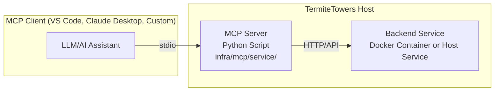
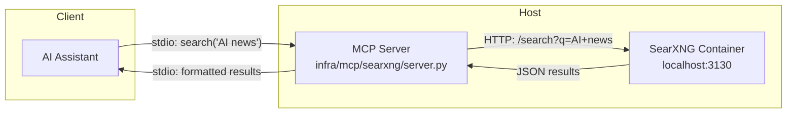

<!--  TermiteTowers Continuous Code Management Header TEMPLATE --- %ccm_git_header_start:  %
  %ccm_git_repo: https://github.com/mpegg007/TermiteTowers.git %
  %ccm_git_branch: main %
  %ccm_git_object_id: wiki/how-to-add-mcp-server.md:97 %
  %ccm_git_author: CCM Maintainer %
  %ccm_git_author_email: ccm@test %
  %ccm_git_blob_sha: c6e37f823b5cd0fac36e29c3b4e5002867697277 %
  %ccm_git_commit_id: f8d51ae7fe101541b1ccd2f91922878ece0bb306 %
  %ccm_git_commit_count: 97 %
  %ccm_git_commit_date: 2025-10-10 20:55:46 -0400 %
  %ccm_git_commit_author: mpegg %
  %ccm_git_commit_email: mpegg@hotmail.com %
  %ccm_git_commit_message: big update %
  %ccm_git_modify_date: 2025-08-29 07:37:53 %
  %ccm_git_file_last_modified: 2025-08-29 07:37:52 %
  %ccm_git_file_name: CCM_HEADER_TEMPLATE.txt %
  %ccm_git_path: CCM_HEADER_TEMPLATE.txt %
  %ccm_git_language_mode:  %
  %ccm_git_file_type: text/plain %
  %ccm_git_file_encoding: us-ascii %
  %ccm_git_file_eol: CRLF %
  %ccm_git_exec: no %
  %ccm_git_size: 659 %
  TermiteTowers Continuous Code Management Header TEMPLATE --- %ccm_git_header_end:  %  -->
<!--
-->

# How to add a new MCP server (dev1)

This is the repeatable pattern for adding Model Context Protocol (MCP) servers to enable LLM integrations with local services and data sources.

## What is MCP?

Model Context Protocol is a standard that allows LLMs (like Claude, GitHub Copilot, or local models) to interact with external tools and data sources. MCP servers expose capabilities (tools, prompts, resources) that LLMs can use.

**Key architectural principle:** MCP servers run on the host (not Docker) and communicate via stdio with MCP clients.

## TL;DR checklist

- Choose a capability/service to expose (web search, database, files, APIs, etc.)
- Create server directory under `infra/mcp/<service>/`
- Implement Python MCP server using `mcp` SDK
- Add dependencies to `requirements.txt`
- Document configuration and usage in `README.md`
- (Optional) Create venv install script
- (Optional) Create symlink at `/srv/dev1/mcp/<service>/` for convenience
- Configure MCP client to use the server
- Test the integration

## Why MCP servers run on host (not Docker)

### MCP Communication Model
- **stdio-based**: Client spawns server process and communicates via stdin/stdout
- **SSE alternative**: HTTP-based, but stdio is standard and simpler
- **Process model**: Designed for lightweight, on-demand spawning

### Docker Limitations for MCP
```yaml
# ❌ This doesn't work for MCP
services:
  mcp-server:
    image: mcp-server:latest
    ports:
      - "3xxx:3xxx"
```

**Problems:**
- Container isolation breaks stdio communication
- Client can't easily spawn containerized processes
- Adds unnecessary complexity and overhead
- Violates MCP's design for lightweight process spawning

### Host-based Pattern (Correct)
```bash
# ✅ MCP client spawns directly
python /srv/dev1/mcp/searxng/server.py

# Or via client config:
{
  "mcpServers": {
    "searxng": {
      "command": "python",
      "args": ["/srv/dev1/mcp/searxng/server.py"]
    }
  }
}
```

## Architecture Overview



**Example: SearXNG Integration**


## Directory Structure

### Standard Layout
```
TermiteTowers/
├── infra/
│   ├── docker/              # Docker services (if applicable)
│   │   └── searxng-dev1.yml
│   └── mcp/                 # MCP servers (NEW)
│       ├── searxng/         # Web search capability
│       │   ├── server.py
│       │   ├── requirements.txt
│       │   ├── README.md
│       │   ├── config.example.json
│       │   └── install.sh   # Optional: venv setup
│       ├── postgres/        # Future: Database queries
│       └── files/           # Future: File system access
```

### Optional Runtime Symlinks
```bash
# Following /srv/dev1 convention
/srv/dev1/mcp/
├── searxng/
│   └── server.py -> /home/mpegg-adm/source/TermiteTowers/infra/mcp/searxng/server.py
└── postgres/
    └── server.py -> /home/mpegg-adm/source/TermiteTowers/infra/mcp/postgres/server.py
```

## Step-by-step Guide

### 1) Choose the capability

Identify what you want to expose to your LLM:
- **Web search** (SearXNG, Google, etc.)
- **Database access** (PostgreSQL, MySQL queries)
- **File operations** (read/write/search files)
- **API integration** (Home Assistant, media servers, etc.)
- **Custom tools** (your own scripts/services)

### 2) Create directory structure

```bash
SERVICE=searxng  # short, lowercase name
mkdir -p /home/mpegg-adm/source/TermiteTowers/infra/mcp/$SERVICE
cd /home/mpegg-adm/source/TermiteTowers/infra/mcp/$SERVICE
```

### 3) Create Python MCP server

**Minimal server template** (`server.py`):
```python
#!/usr/bin/env python3
"""
MCP Server for [SERVICE NAME]
Exposes [CAPABILITY] to LLM clients via Model Context Protocol
"""

import asyncio
import json
from mcp.server import Server
from mcp.server.stdio import stdio_server
from mcp.types import Tool, TextContent

# Your service client/logic
async def perform_action(param: str) -> str:
    """Your integration logic here"""
    # Example: HTTP request to local service
    # return await call_service(param)
    return f"Result for {param}"

# Initialize MCP server
app = Server("service-name")

@app.list_tools()
async def list_tools() -> list[Tool]:
    """Define tools available to LLM"""
    return [
        Tool(
            name="tool_name",
            description="What this tool does - be specific for LLM understanding",
            inputSchema={
                "type": "object",
                "properties": {
                    "param": {
                        "type": "string",
                        "description": "Parameter description"
                    }
                },
                "required": ["param"]
            }
        )
    ]

@app.call_tool()
async def call_tool(name: str, arguments: dict) -> list[TextContent]:
    """Handle tool invocations from LLM"""
    if name == "tool_name":
        result = await perform_action(arguments["param"])
        return [TextContent(type="text", text=result)]
    
    raise ValueError(f"Unknown tool: {name}")

async def main():
    """Run the MCP server via stdio"""
    async with stdio_server() as (read_stream, write_stream):
        await app.run(read_stream, write_stream, app.create_initialization_options())

if __name__ == "__main__":
    asyncio.run(main())
```

### 4) Create requirements.txt

```txt
# MCP SDK
mcp>=0.1.0

# HTTP client (if needed)
httpx>=0.27.0

# Any service-specific dependencies
# aiofiles  # for file operations
# asyncpg   # for PostgreSQL
# homeassistant-api  # for HA integration
```

### 5) Create README.md

Document the server:
```markdown
# MCP Server: [Service Name]

## Purpose
Brief description of what capability this exposes to LLMs.

## Requirements
- Python 3.10+
- [Backend service] running at [location/port]

## Installation

### Option 1: System Python
\`\`\`bash
pip install -r requirements.txt
\`\`\`

### Option 2: Virtual Environment (Recommended)
\`\`\`bash
bash install.sh
\`\`\`

## Configuration

[Explain any config files or environment variables]

## MCP Client Setup

### VS Code / GitHub Copilot
Add to your MCP settings:
\`\`\`json
{
  "mcpServers": {
    "service-name": {
      "command": "python",
      "args": ["/srv/dev1/mcp/service/server.py"]
    }
  }
}
\`\`\`

### Claude Desktop
Add to `claude_desktop_config.json`:
\`\`\`json
{
  "mcpServers": {
    "service-name": {
      "command": "python",
      "args": ["/home/mpegg-adm/source/TermiteTowers/infra/mcp/service/server.py"]
    }
  }
}
\`\`\`

## Testing

\`\`\`bash
# Test server directly
python server.py
# Then type MCP protocol messages or use an MCP inspector

# Test with MCP client
[Client-specific test commands]
\`\`\`

## Tools Provided

- **tool_name**: Description of what it does

## Example Usage

\`\`\`
User: [Example prompt that would use this tool]
LLM: [Uses tool_name with parameters]
Result: [What the user sees]
\`\`\`
```

### 6) Optional: Create install.sh

For easier venv setup:
```bash
#!/usr/bin/env bash
# Install MCP server with isolated dependencies

set -euo pipefail

SCRIPT_DIR="$(cd "$(dirname "${BASH_SOURCE[0]}")" && pwd)"
VENV_DIR="$SCRIPT_DIR/venv"

echo "Creating virtual environment..."
python3 -m venv "$VENV_DIR"

echo "Installing dependencies..."
"$VENV_DIR/bin/pip" install --upgrade pip
"$VENV_DIR/bin/pip" install -r "$SCRIPT_DIR/requirements.txt"

echo "✓ Installation complete!"
echo ""
echo "To use this MCP server, update your client config:"
echo "  command: $VENV_DIR/bin/python"
echo "  args: [\"$SCRIPT_DIR/server.py\"]"
```

Make it executable:
```bash
chmod +x install.sh
```

### 7) Optional: Create convenience symlink

```bash
SERVICE=searxng
sudo mkdir -p /srv/dev1/mcp/$SERVICE
sudo ln -sf /home/mpegg-adm/source/TermiteTowers/infra/mcp/$SERVICE/server.py \
            /srv/dev1/mcp/$SERVICE/server.py
```

**Note:** If using venv, symlink the entire directory or adjust client config paths.

### 8) Configure MCP client

**Location depends on client:**
- **VS Code**: Settings → Extensions → GitHub Copilot → MCP Servers
- **Claude Desktop**: `~/Library/Application Support/Claude/claude_desktop_config.json` (macOS)
- **Custom client**: Your application's config

**Example configuration:**
```json
{
  "mcpServers": {
    "searxng": {
      "command": "python",
      "args": ["/srv/dev1/mcp/searxng/server.py"],
      "env": {
        "SEARXNG_URL": "http://localhost:3130"
      }
    }
  }
}
```

### 9) Test the integration

```bash
# Test 1: Server starts without errors
python /home/mpegg-adm/source/TermiteTowers/infra/mcp/$SERVICE/server.py

# Test 2: MCP protocol communication
# Use an MCP inspector or client to send requests

# Test 3: End-to-end with LLM
# Open MCP client and ask questions that would use the tool
```

### 10) Documentation

Update relevant docs:
- Add entry to `wiki/README.md` under MCP servers section
- Create runbook if service is complex: `wiki/runbook-mcp-<service>.md`
- Document any dependencies or backend services needed

## Common Patterns

### HTTP Service Integration (SearXNG, APIs)

```python
import httpx

async def search_web(query: str, base_url: str = "http://localhost:3130") -> str:
    """Query SearXNG for web results"""
    async with httpx.AsyncClient() as client:
        response = await client.get(
            f"{base_url}/search",
            params={"q": query, "format": "json"}
        )
        response.raise_for_status()
        data = response.json()
        
        # Format results for LLM
        results = []
        for result in data.get("results", [])[:5]:  # Top 5
            results.append(f"- {result['title']}\n  {result['url']}\n  {result.get('content', '')[:200]}")
        
        return "\n\n".join(results)
```

### Database Integration (PostgreSQL)

```python
import asyncpg

async def query_database(query: str, connection_string: str) -> str:
    """Execute read-only database query"""
    conn = await asyncpg.connect(connection_string)
    try:
        # Safety: only allow SELECT
        if not query.strip().upper().startswith("SELECT"):
            raise ValueError("Only SELECT queries allowed")
        
        rows = await conn.fetch(query)
        
        # Format as markdown table
        if not rows:
            return "No results"
        
        # Build table...
        return formatted_table
    finally:
        await conn.close()
```

### File System Access

```python
import aiofiles
from pathlib import Path

async def read_file(path: str, allowed_dirs: list[str]) -> str:
    """Read file with safety checks"""
    file_path = Path(path).resolve()
    
    # Security: ensure within allowed directories
    if not any(file_path.is_relative_to(d) for d in allowed_dirs):
        raise ValueError(f"Path {path} not in allowed directories")
    
    async with aiofiles.open(file_path, 'r') as f:
        content = await f.read()
        return content
```

### Home Assistant Integration

```python
import httpx

async def control_device(
    entity_id: str,
    action: str,
    ha_url: str = "http://localhost:8123",
    token: str = None
) -> str:
    """Control Home Assistant device"""
    headers = {
        "Authorization": f"Bearer {token}",
        "Content-Type": "application/json"
    }
    
    async with httpx.AsyncClient() as client:
        response = await client.post(
            f"{ha_url}/api/services/{action}",
            headers=headers,
            json={"entity_id": entity_id}
        )
        response.raise_for_status()
        return f"Successfully executed {action} on {entity_id}"
```

## Security Considerations

### Input Validation
```python
# Always validate and sanitize inputs
def validate_query(query: str) -> str:
    """Sanitize search query"""
    # Remove potentially dangerous characters
    # Limit length
    # Escape as needed
    return sanitized_query
```

### Access Control
```python
# Restrict to allowed paths/resources
ALLOWED_DIRECTORIES = [
    "/mnt/ai_storage/documents",
    "/home/mpegg-adm/safe-access"
]

# Check permissions before operations
if not has_permission(user, resource):
    raise PermissionError()
```

### Rate Limiting
```python
from asyncio import Semaphore

# Limit concurrent operations
rate_limiter = Semaphore(5)

async def rate_limited_operation():
    async with rate_limiter:
        # perform operation
        pass
```

### Secrets Management
```python
import os

# Never hardcode secrets
API_TOKEN = os.getenv("SERVICE_API_TOKEN")
if not API_TOKEN:
    raise ValueError("SERVICE_API_TOKEN environment variable required")
```

## Troubleshooting

### Server won't start
```bash
# Check Python version
python --version  # Must be 3.10+

# Check dependencies
pip list | grep mcp

# Check for syntax errors
python -m py_compile server.py

# Run with verbose logging
python server.py 2>&1 | tee mcp-server.log
```

### Client can't connect
```bash
# Verify server runs standalone
python server.py
# Should not exit immediately

# Check client config syntax
cat ~/.config/[client]/mcp_config.json | jq .

# Verify paths are absolute
# BAD:  "args": ["./server.py"]
# GOOD: "args": ["/srv/dev1/mcp/service/server.py"]
```

### Tool not showing up in LLM
- Check tool description is clear and specific
- Verify `list_tools()` returns the tool
- Restart MCP client after server changes
- Check client logs for MCP protocol errors

### Service connection fails
```bash
# Test backend service is running
curl http://localhost:3130/  # Example for SearXNG

# Check network connectivity
ping localhost

# Verify service ports
netstat -tlnp | grep 3130

# Check firewall rules if applicable
sudo ufw status
```

## Future Infrastructure Plans

As mentioned, TermiteTowers infrastructure may evolve:
```
infra/
├── http/
│   └── nginx/        # Migrated from infra/nginx/
├── llm/              # Future: LLM-specific infrastructure
│   ├── models/
│   ├── configs/
│   └── mcp/         # Could move here
├── mcp/             # Current location
├── docker/
└── dns/
```

MCP servers are infrastructure that enables LLM capabilities, so they belong in `infra/` hierarchy. Exact location may change but pattern remains the same.

## Examples

See implemented MCP servers:
- `infra/mcp/searxng/` - Web search via SearXNG

## References

- [Model Context Protocol Specification](https://modelcontextprotocol.io/)
- [MCP Python SDK](https://github.com/modelcontextprotocol/python-sdk)
- [XDA Article: MCP Changed My Local LLM](https://www.xda-developers.com/mcp-servers-changed-local-llm-better-than-cloud/)
- TermiteTowers wiki: `how-to-add-docker-app.md`, `compose-conventions.md`
