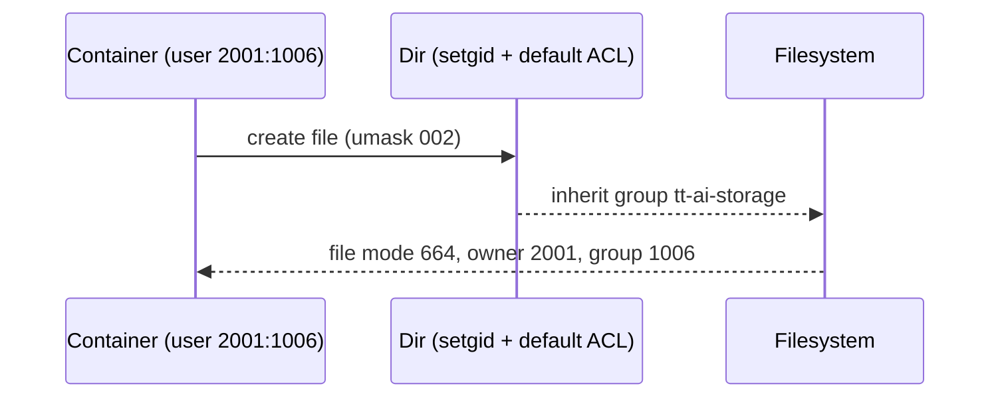

# Storage and Permissions Model

Goal: Neutral, non-root, non-personal UID for all service/container writes, with multi-user read/write access via a shared group.

- Service user: `storage-svc` (UID 2001)
- Shared group: `tt-ai-storage` (GID 1006)
- Mount root: `/mnt/ai_storage`
- New files/dirs: group-writable by default (umask 002 + setgid + default ACL)

## Directory layout
```
/mnt/ai_storage/
  models/
    huggingface/
    pip/
    torch/
    whisper/
  openwebui/
    data/
  tortoise/
    voices/
    outputs/
  wiki/
    postgres-data/
    wikijs-data/
```

## Unix permissions
- All top-level app dirs are owned by `storage-svc:tt-ai-storage` with `2775` (drwxrwsr-x)
- Default ACLs ensure group write on new files/dirs:
  - `setfacl -d -m g:tt-ai-storage:rwx <dir>`
  - `setfacl -m g:tt-ai-storage:rwx <dir>`
- Verify with `getfacl -p <dir>`; create test files to confirm 664/775 modes.

## Container behavior
- Compose files run with `user: ${UID_SVC:-2001}:${GID_TT_AI:-1006}`
- Ensure group-write inheritance inside containers: `umask 002`
- Prefer caches under `/cache/*` and bind to `/mnt/ai_storage/models/*`

## Notes
- Avoid chowning to root or personal UIDs.
- Add users who need write access to `tt-ai-storage`.
- If a service creates root-owned files, check its UID/GID or init scripts.

## Permissions flow (Mermaid)

