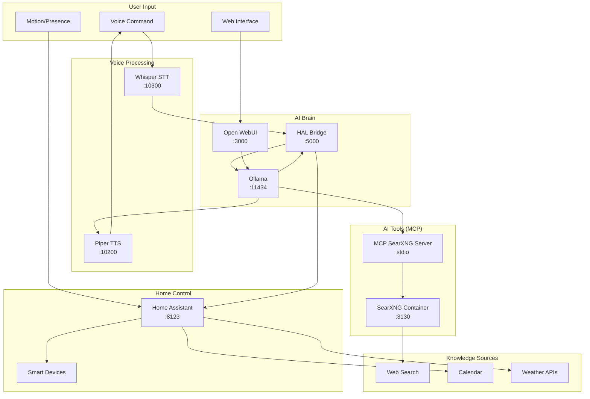

<!--  TermiteTowers Continuous Code Management Header TEMPLATE --- %ccm_git_header_start:  %
  %ccm_git_repo: https://github.com/mpegg007/TermiteTowers.git %
  %ccm_git_branch: main %
  %ccm_git_object_id: wiki/vision-hal-enterprise-computer.md:97 %
  %ccm_git_author: CCM Maintainer %
  %ccm_git_author_email: ccm@test %
  %ccm_git_blob_sha: c6e37f823b5cd0fac36e29c3b4e5002867697277 %
  %ccm_git_commit_id: f8d51ae7fe101541b1ccd2f91922878ece0bb306 %
  %ccm_git_commit_count: 97 %
  %ccm_git_commit_date: 2025-10-10 20:55:46 -0400 %
  %ccm_git_commit_author: mpegg %
  %ccm_git_commit_email: mpegg@hotmail.com %
  %ccm_git_commit_message: big update %
  %ccm_git_modify_date: 2025-08-29 07:37:53 %
  %ccm_git_file_last_modified: 2025-08-29 07:37:52 %
  %ccm_git_file_name: CCM_HEADER_TEMPLATE.txt %
  %ccm_git_path: CCM_HEADER_TEMPLATE.txt %
  %ccm_git_language_mode:  %
  %ccm_git_file_type: text/plain %
  %ccm_git_file_encoding: us-ascii %
  %ccm_git_file_eol: CRLF %
  %ccm_git_exec: no %
  %ccm_git_size: 659 %
  TermiteTowers Continuous Code Management Header TEMPLATE --- %ccm_git_header_end:  %  -->
<!--
-->

# Vision: HAL/Enterprise Computer System

## The Goal

Build an awesome HAL 9000 / Star Trek Enterprise Computer-like interface - but actually smart. A fully local, privacy-preserving voice-controlled AI assistant with real-time knowledge and home automation integration.

**Inspiration:**
- HAL 9000 (2001: A Space Odyssey) - Conversational AI interface
- Enterprise Computer under Captain Picard - Always available, contextually aware, helpful

**Core Principle:** Everything runs locally - no cloud dependencies, complete privacy, full control.

## End State Vision

### Morning Scenario (The Dream)

```
[User walks into bathroom at 7:00 AM]
[Motion sensor detects presence]

Computer: "Good morning. The Maple Leafs won 4-2 last night. 
          Matthews scored twice. Current temperature is 12°C 
          with rain expected this afternoon. You have two 
          meetings today at 10 AM and 2 PM. Would you like 
          me to start the coffee maker?"

User: "Yes, and what's the news today?"

Computer: "Top headlines: [fresh web search results]..."
```

### Key Capabilities

**Voice Interaction:**
- Natural conversation (not robotic commands)
- Context-aware responses
- Proactive information delivery based on presence/time/routine

**Real-Time Knowledge:**
- Sports scores from yesterday/today
- Current weather and forecast
- News headlines and updates
- Traffic conditions
- Calendar events
- Any web-searchable information

**Home Control:**
- All Home Assistant devices controllable by voice
- Automated routines triggered by presence/time
- Status reporting ("Are all the doors locked?")
- Scene activation ("Movie time", "Good night")

**Privacy & Local:**
- All AI processing happens locally (Ollama)
- Voice recognition on-device (Whisper)
- No cloud AI services
- Data stays in TermiteTowers

## Current Architecture (2025-10-08)

### What's Working ✅

**Voice Pipeline:**
```
Microphone → Whisper STT (localhost:10300) → 
HAL Bridge (localhost:5000) → 
Ollama (localhost:11434) → 
Piper TTS (localhost:10200) → Speakers
```

**Components:**
- **Whisper STT**: Wyoming protocol, port 10300, local speech-to-text
- **Piper TTS**: Wyoming protocol, port 10200, local text-to-speech  
- **HAL Bridge**: Flask app, port 5000, integrates HA with LLM
- **Ollama**: Port 11434, running Home-3B-v3 model
- **Home Assistant**: Full smart home integration
- **LM Studio**: Alternative LLM on port 1234

**Startup:**
- `TermiteTowers/startup.sh` → `scripts/system/startup.sh`
- Starts STT, TTS, and HAL bridge
- Health checks on all ports

### What We're Adding 🚧

**Web Search Integration (3 Approaches):**

#### Approach 1: llm-server Handler (RECOMMENDED for HAL)
```
Voice → HAL Bridge → llm-server /search → 
SearXNG (localhost:3130) → 
Results → Ollama → Voice Response
```

**Why this approach:**
- HAL Bridge already calls llm-server for parsing
- Follows existing pattern (home_assistant, media handlers)
- Works with direct Ollama calls (HAL's architecture)
- Simple HTTP endpoint, no MCP complexity

#### Approach 2: LobeChat Custom Plugin
```
LobeChat UI → Custom Plugin Service → 
SearXNG → Results → LobeChat → User
```

**Requires:**
- Node.js service with plugin manifest
- Gateway implementation  
- Custom UI (optional)
- More complex than llm-server handler

#### Approach 3: Open WebUI Pipe/Function
```
Open WebUI → Python Pipe → 
SearXNG → Results → Open WebUI → User
```

**Requires:**
- Open WebUI pipe Python script
- Configured in Open WebUI admin
- Only works within Open WebUI, not HAL

**Note on MCP:** Model Context Protocol exists in two incompatible forms:
- **stdio MCP**: Used by LM Studio, VS Code Continue, Claude Desktop
- **streamable HTTP MCP**: Used by Open WebUI v0.6.31+, LobeChat
- Pre-built `npx mcp-searxng` is stdio-based, won't work with web UIs

**New Components:**
- **SearXNG**: Privacy-focused metasearch, Docker container, port 3130
- **llm-server search handler**: Python endpoint in `llm_server/handlers/search.py`
- **Integration route**: Added to llm-server main.py

**Capability Unlocked:**
- "What were the Leafs scores yesterday?" → Fresh web search
- "What's the weather today?" → Current conditions
- "What's in the news?" → Latest headlines
- Any question requiring current information

## Technology Stack

### Voice & Audio
- **Whisper**: OpenAI's speech recognition (local)
- **Piper**: Neural TTS voices (local)
- **Wyoming Protocol**: Standard for STT/TTS communication

### AI & LLM
- **Ollama**: Local LLM runtime
- **Models**: Home-3B-v3-GGUF (Home Assistant optimized)
- **LM Studio**: Alternative/backup LLM runtime
- **MCP**: Model Context Protocol for tool integration

### Home Automation
- **Home Assistant**: Core smart home platform
- **HAL Bridge**: Custom Python Flask integration
- **LLM Server**: FastAPI service (`llm-server` repo)

### Search & Knowledge
- **SearXNG**: Privacy metasearch engine (Docker)
- **MCP Servers**: Tool protocol for LLM integrations
- **Web Search**: DuckDuckGo, Brave, Google (via SearXNG)

### Infrastructure
- **Docker**: Container runtime for services
- **Nginx**: Reverse proxy (https://*.termitetowers.ca)
- **systemd**: Service management for STT/TTS
- **TermiteTowers**: Infrastructure repository

## System Integration Map



## Implementation Roadmap

### Phase 1: Foundation ✅ (Complete)
- [x] Home Assistant core setup
- [x] Ollama local LLM
- [x] Whisper STT (Wyoming)
- [x] Piper TTS (Wyoming)
- [x] HAL Bridge (Flask)
- [x] Basic voice control
- [x] TermiteTowers infrastructure

### Phase 2: Real-Time Knowledge 🚧 (In Progress)
- [x] SearXNG Docker deployment
- [x] SearXNG accessible at search.termitetowers.ca
- [x] Evaluated MCP approaches (stdio vs streamable HTTP incompatibility)
- [ ] Add search handler to llm-server (`handlers/search.py`)
- [ ] Integrate search handler with HAL Bridge
- [ ] Test web search via voice commands: "What were the scores yesterday?"
- [ ] (Optional) Implement LobeChat custom plugin for web UI testing
- [ ] (Optional) Implement Open WebUI pipe for comparison

### Phase 3: Intelligence & Context 📋 (Planned)
- [ ] Calendar integration (Google/Outlook)
- [ ] Sports scores API integration
- [ ] Weather API integration  
- [ ] News aggregation
- [ ] Routine/context learning
- [ ] Proactive information delivery

### Phase 4: Automation & Presence 📋 (Planned)
- [ ] Room-based presence detection
- [ ] Context-aware greetings
- [ ] Automated morning briefings
- [ ] Routine triggers (bathroom = morning brief)
- [ ] Multi-room audio coordination
- [ ] Natural conversation flow

### Phase 5: Advanced Features 📋 (Future)
- [ ] Multi-user recognition
- [ ] Personalized responses per user
- [ ] Learning preferences
- [ ] Conversation history
- [ ] Emotion/tone detection
- [ ] Continuous listening mode

## Current Status (2025-10-08)

**Working:**
- Voice control via Whisper → Ollama → Piper
- Home Assistant device control
- Basic conversational AI
- Local processing (privacy preserved)

**In Progress:**
- SearXNG deployed and running (localhost:3130)
- MCP investigation complete (stdio vs streamable HTTP documented)
- Designing llm-server search handler integration

**Next Steps:**
1. Add `llm_server/handlers/search.py` (queries SearXNG)
2. Update `llm_server/main.py` with `/search` route
3. Integrate search handler into HAL Bridge voice flow
4. Test: "What were the scores yesterday?" via voice
5. (Optional) Test alternative approaches: LobeChat plugin, Open WebUI pipe
6. Expand to weather, news, calendar integrations

## Documentation

**Related Wiki Pages:**
- `wiki/how-to-add-docker-app.md` - Docker deployment patterns
- `wiki/how-to-add-mcp-server.md` - MCP server implementation guide
- `wiki/voice-assistant-architecture.md` - Voice pipeline details
- `wiki/how-to-extend-voice-assistant.md` - Adding capabilities
- `wiki/runbook-ha-hal-bridge.md` - HAL bridge operations
- `wiki/ports.md` - Port allocations

**Repositories:**
- `TermiteTowers` - Infrastructure, configs, scripts
- `llm-server` - FastAPI LLM integration service
- `home-assistant-config` - HA configuration

## Design Principles

1. **Privacy First**: Everything local, no cloud AI
2. **Reliability**: No internet dependency for core functions
3. **Extensibility**: Easy to add new capabilities via MCP
4. **Natural Interaction**: Conversation, not commands
5. **Context Awareness**: Understand routine and preferences
6. **Proactive**: Anticipate needs, don't just respond
7. **Transparent**: Clear what data is used and how

## Success Criteria

The system will be considered successful when:

- [x] Voice commands control all HA devices reliably
- [ ] "What were the scores?" returns accurate, current results
- [ ] Morning bathroom routine triggers contextual briefing
- [ ] Weather queries return current, location-specific data
- [ ] News requests provide recent headlines
- [ ] 95%+ accuracy on voice recognition
- [ ] <2 second response time for simple queries
- [ ] <5 second response time for web search queries
- [ ] No cloud dependencies for core functionality
- [ ] Wife uses it without technical knowledge
- [ ] Guests say "that's cool!" not "that's complicated"

## Lessons Learned

**What Works:**
- Local LLMs are capable enough for home control
- Wyoming protocol great for STT/TTS standardization  
- MCP provides clean abstraction for tool integration
- Docker simplifies service deployment
- SearXNG excellent for privacy-preserving search

**Challenges:**
- GitHub Container Registry rate limits (solved: force image refresh)
- MCP ecosystem fragmentation (stdio vs streamable HTTP incompatibility)
- Open WebUI/LobeChat use streamable HTTP MCP, not stdio (npx packages won't work)
- Balancing model size vs. capability vs. speed
- Voice recognition accuracy in noisy environments (ongoing)
- Avoiding overconfident AI guidance without verification

**Future Considerations:**
- Model fine-tuning for better home-specific responses
- Edge TPU/GPU acceleration for faster inference
- Multiple microphone array for better voice pickup
- Integration with vehicle for "leaving home" routines

---

**Last Updated:** 2025-10-08  
**Status:** Phase 2 - Real-Time Knowledge Integration  
**Next Milestone:** MCP + SearXNG functional web search via voice
